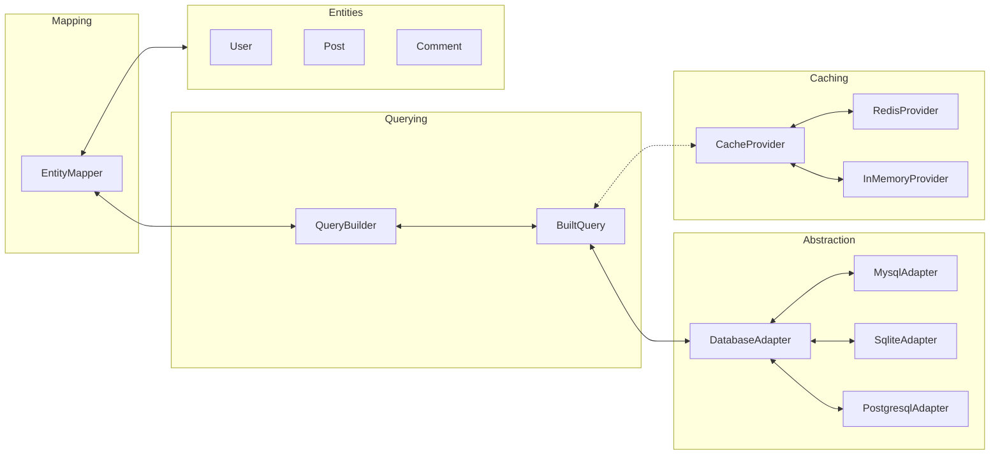
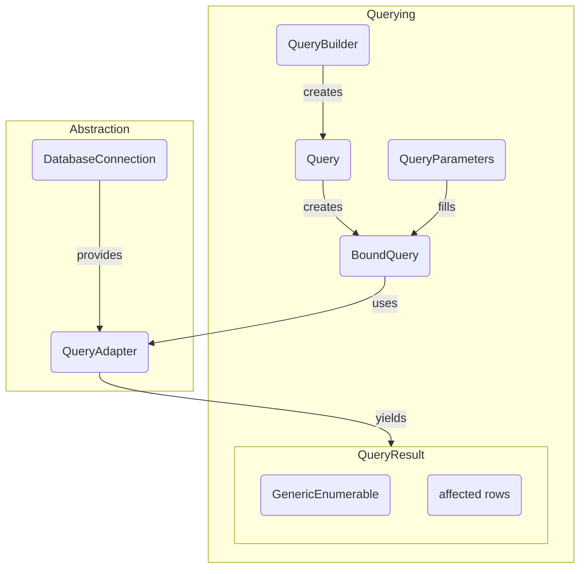

Query definition in EBNF:

```
query       = identifer , param + ;
param       = identifer | query | expression ;
expression  = value operator value ;
operator    = identifer | symbol ;
value       = identifer | expression ;
identifer   = letter , ( letter | digit | "." ) + ;
```

QueryBuilder flow:


