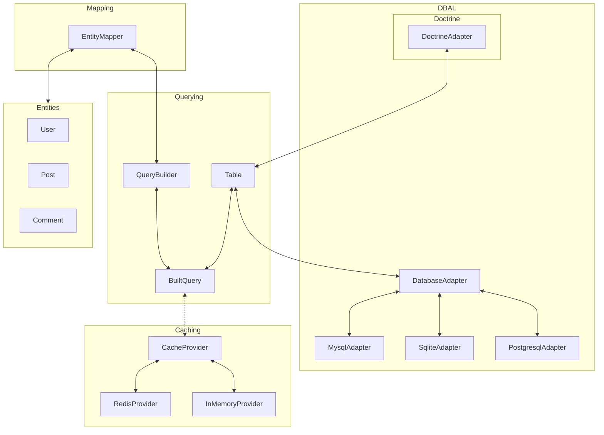

```mermaid
flowchart
    subgraph Querying
    Table <--> BuiltQuery
    QueryBuilder <--> BuiltQuery
    end
    
        subgraph DBAL
            DatabaseAdapter <--> MysqlAdapter
            DatabaseAdapter <--> SqliteAdapter
            DatabaseAdapter <--> PostgresqlAdapter
            
            subgraph Doctrine
                DoctrineAdapter
            end
        end
    
        subgraph Mapping
            EntityMapper
        end
    
        subgraph Entities
            User
            Post
            Comment
        end
    
        subgraph Caching
            CacheProvider <--> RedisProvider
            CacheProvider <--> InMemoryProvider
        end
    
        BuiltQuery <-.-> CacheProvider
        Table <--> DatabaseAdapter
        DoctrineAdapter <--> Table
        EntityMapper <--> Entities
        EntityMapper <--> QueryBuilder
```
